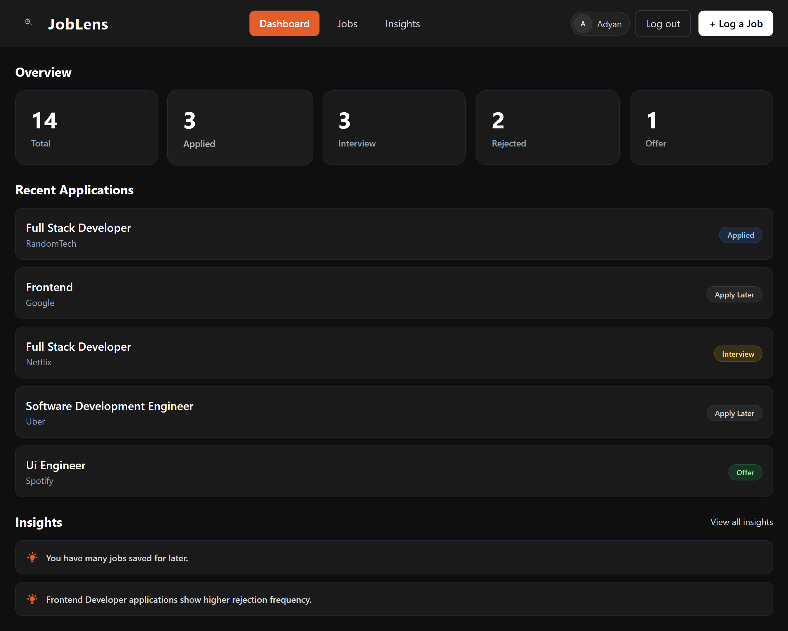
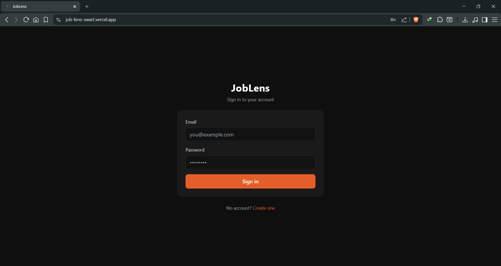
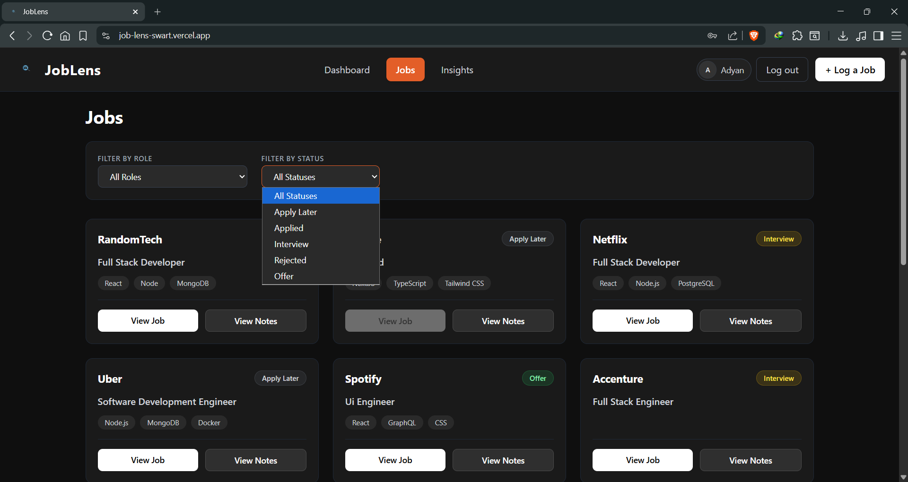
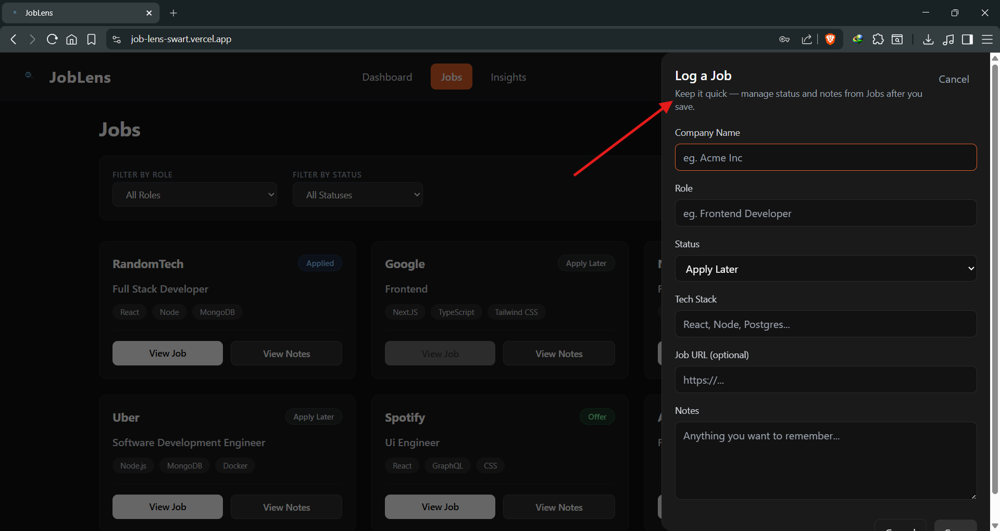
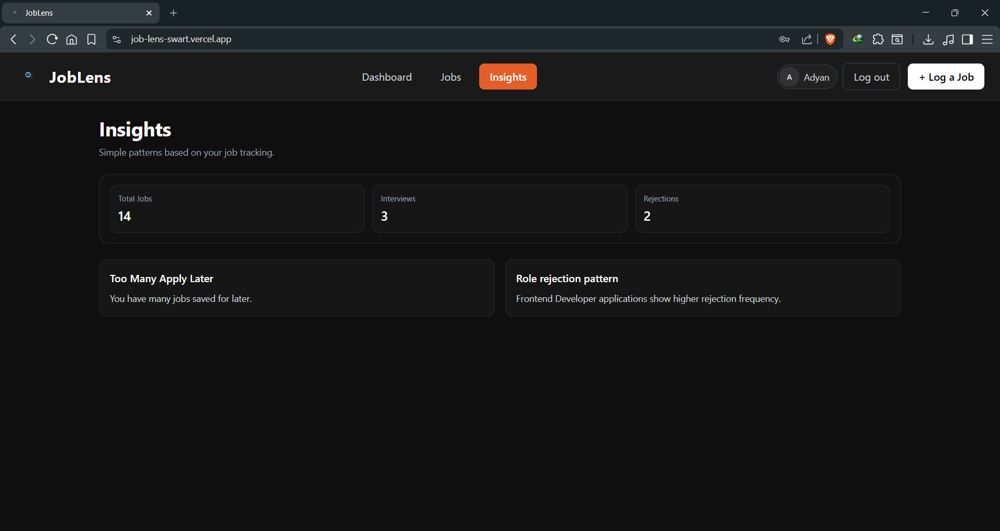
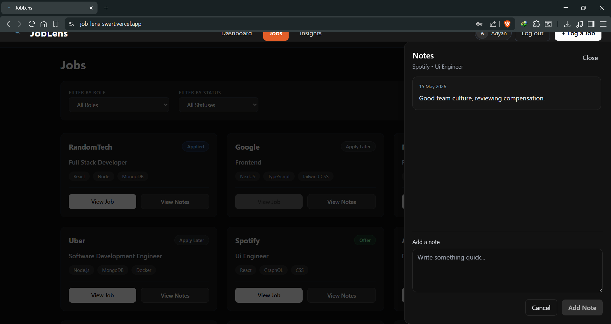

# JobLens

JobLens is a small full-stack app for tracking job applications in one place. You log roles and companies, jot notes as things move along, and get a few simple, rule-based insights from your own data (nothing fancy or “AI” here—just counts and thresholds). Accounts are per user, so your list stays yours.

---
## Live Demo

https://job-lens-swart.vercel.app/
---
## Features

- **Sign up / sign in** with email and password  
- **JWT auth** — session survives refresh until the token expires  
- **Dashboard** — quick stats, recent applications, a preview of insights  
- **Jobs** — log applications from the navbar, filter by role and status, and open the posting in a new tab when you saved a URL  
- **Notes** — per-job notes in a slide-over panel  
- **Insights** — lightweight patterns (e.g. interview rate vs applied, “apply later” pile-up, rejection-heavy roles)  
- **Dynamic filters** — role dropdown is built from what you’ve actually logged  
- **Role normalization** — titles are cleaned up for display and matching (e.g. casing and spacing)  
- **Responsive UI** — Tailwind-based layout that works on smaller screens  

---

## Tech stack

| | |
| --- | --- |
| **Frontend** | React, Vite, Tailwind CSS |
| **Backend** | Node.js, Express, MongoDB (Mongoose) |

---

## Folder structure

```
frontend/     # Vite + React client
backend/      # Express API + MongoDB models
```

The API lives under `/api` (auth and jobs). The client talks to it using `VITE_BACKEND_URL`.

---

## Setup

You’ll need **Node.js** (LTS is fine) and a **MongoDB** connection string (Atlas is what I used).

### Backend

```bash
cd backend
npm install
```

Copy `backend/.env.example` to `backend/.env` and fill in real values (see [Environment variables](#environment-variables)).

```bash
npm run dev
```

By default the server listens on port **5000** unless you set `PORT`.

### Frontend

```bash
cd frontend
npm install
```

Copy `frontend/.env.example` to `frontend/.env` and point the API URL at your backend (local or deployed).

```bash
npm run dev
```

Vite usually serves the app at **http://localhost:5173**. The backend CORS setup allows that in development even if you don’t set `FRONTEND_URL`.

---

## Environment variables

### Frontend (`frontend/.env`)

| Variable | Purpose |
| --- | --- |
| `VITE_BACKEND_URL` | Base URL of the API, e.g. `http://localhost:5000` (no trailing slash) |

### Backend (`backend/.env`)

| Variable | Purpose |
| --- | --- |
| `MONGO_URI` | MongoDB connection string |
| `JWT_SECRET` | Secret used to sign JWTs (use something long and random in production) |
| `PORT` | Server port (optional, defaults to `5000`) |
| `FRONTEND_URL` | In **production** (`NODE_ENV=production`), browsers are only allowed from this origin (e.g. `https://your-site.net`). In development, `http://localhost` / `http://127.0.0.1` on any port are allowed; if `FRONTEND_URL` is unset in dev, other origins are allowed too so local setups stay easy. |

---
## 📸 Screenshots

### Dashboard Overview
Track applications, interviews, rejections, and recent activity.



### Authentication
Secure login and signup with JWT authentication.



### Job Tracking & Filters
Manage jobs with role and status filters.



### Log a Job
Add company, role, status, tech stack, interview dates, and notes.



### Insights
View simple job application insights and patterns.



### Notes Panel
Save reminders, interview feedback, and follow-up notes.


## Future improvements

Ideas I’d tackle next if I kept building this out:

- Edit and delete jobs (right now you add and update through notes / status on the card flow, but there’s no full “edit job” API)  
- Simple charts (applications over time, funnel by status)    
- Richer analytics (sources, response times, custom tags)  

---

## Production notes

- Set `NODE_ENV=production` and a strong `JWT_SECRET`.  
- Set `FRONTEND_URL` to your deployed frontend origin so CORS stays tight.  
- Rebuild the frontend after changing `VITE_BACKEND_URL` so the client bundle picks up the right API base.  

---

## Author

Built as a portfolio-style MERN project—something I’d actually use while job hunting, documented the way I’d want to read it a month later.
